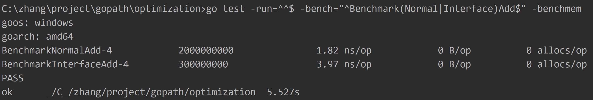
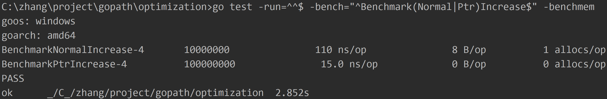

Golang optimization example.

# optimization

#### 1. ***bytes and string convert***
```
package optimization

import (
	"unsafe"
	"testing"
)

func Bytes2String(bs []byte) string {
	return *(*string)(unsafe.Pointer(&bs))
}

func String2Bytes(str string) []byte {
	x := (*[2]uintptr)(unsafe.Pointer(&str))
	h := [3]uintptr{x[0], x[1], x[1]}
	return *(*[]byte)(unsafe.Pointer(&h))
}

var Str string
var Bs []byte

// go test -run=^^$ -bench=^BenchmarkNormalB2S$ -benchmem
func BenchmarkNormalB2S(b *testing.B) {
	bs := []byte{'t', 'e', 's', 't'}
	for i := 0; i < b.N; i++ {
		Str = string(bs)
	}
}

// go test -run=^^$ -bench=^BenchmarkOptimizationB2S$ -benchmem
func BenchmarkOptimizationB2S(b *testing.B) {
	bs := []byte{'t', 'e', 's', 't'}
	for i := 0; i < b.N; i++ {
		Str = Bytes2String(bs)
	}
}

// go test -run=^^$ -bench=^BenchmarkNormalS2B$ -benchmem
func BenchmarkNormalS2B(b *testing.B) {
	str := "test"
	for i := 0; i < b.N; i++ {
		Bs = []byte(str)
	}
}

// go test -run=^^$ -bench=^BenchmarkOptimizationS2B$ -benchmem
func BenchmarkOptimizationS2B(b *testing.B) {
	str := "test"
	for i := 0; i < b.N; i++ {
		Bs = String2Bytes(str)
	}
}
```
**benchmark test**
```
go test -run="^^$" -bench="Benchmark(Normal|Optimization)(B2S|S2B)$" -benchmem
```


#### 2. ***array and slice***
```
package optimization

import "testing"

const cap = 1024

func initArray() [cap]int {
	var array [cap]int
	for i := 0; i < cap; i++ {
		array[i] = i
	}
	return array
}

func initSlice() []int {
	var slice = make([]int, cap)
	for i := 0; i < cap; i++ {
		slice[i] = i
	}
	return slice
}

// go test -run=^^$ -bench=^BenchmarkArray$ -benchmem
func BenchmarkArray(b *testing.B) {
	for i := 0; i < b.N; i++ {
		_ = initArray()
	}
}

// go test -run=^^$ -bench=^BenchmarkSlice$ -benchmem
func BenchmarkSlice(b *testing.B) {
	for i := 0; i < b.N; i++ {
		_ = initSlice()
	}
}
```
**benchmark test**
```
go test -run=^^$ -bench="Benchmark(Array|Slice)$" -benchmem
```


#### 3. ***defer***
```
package optimization

import (
	"testing"
	"sync"
)

var lock sync.Mutex

func normalUnlock() {
	lock.Lock()
	lock.Unlock()
}

func deferUnlock() {
	lock.Lock()
	defer lock.Unlock()
}

// go test -run=^^$ -bench="^BenchmarkNormalUnlock$" -benchmem
func BenchmarkNormalUnlock(b *testing.B) {
	for i :=0; i < b.N;i++ {
		normalUnlock()
	}
}

// go test -run=^^$ -bench="^BenchmarkDeferUnlock$" -benchmem
func BenchmarkDeferUnlock(b *testing.B) {
	for i :=0; i < b.N;i++ {
		deferUnlock()
	}
}
```
**benchmark test**
```
go test -run=^^$ -bench="^Benchmark(Normal|Defer)Unlock$" -benchmem
```


#### 4. ***closure***
```
package optimization

import "testing"

func function(i int) {
	t := i
	t++
}

// go test -run=^^$ -bench=^BenchmarkNormal$ -benchmem
func BenchmarkNormal(b *testing.B) {
	for i := 0; i < b.N; i++ {
		function(i)
	}
}

// go test -run=^^$ -bench=^BenchmarkAnonymous$ -benchmem
func BenchmarkAnonymous(b *testing.B) {
	for i := 0; i < b.N; i++ {
		func(i int) {
			t := i
			t++
		}(i)
	}
}

// go test -run=^^$ -bench=^BenchmarkClosure$ -benchmem
func BenchmarkClosure(b *testing.B) {
	for i := 0; i < b.N; i++ {
		func() {
			t := i
			t++
		}()
	}
}
```
**benchmark test**
```
go test -run=^^$ -bench="^Benchmark(Normal|Anonymous|Closure)$" -benchmem
```


#### 5. ***chan mutex atomic waitGroup***
```
package optimization

import (
	"sync"
	"testing"
	"sync/atomic"
)

var chanCount int32

func chanAdd(channel chan struct{}) {
	<-channel
	chanCount++
	channel <- struct{}{}
}

func mutexAdd(mutex sync.Locker) {
	mutex.Lock()
	chanCount++
	mutex.Unlock()
}

func atomicAdd() {
	atomic.AddInt32(&chanCount, 1)
}

func waitGroupAdd(wg *sync.WaitGroup) {
	wg.Add(1)
	chanCount++
	wg.Done()
}

// go test -run=^^$ -bench=^BenchmarkChan$ -benchmem
func BenchmarkChan(b *testing.B) {
	channel := make(chan struct{}, 1)
	channel <- struct{}{}
	b.ResetTimer()
	for i := 0; i < b.N; i++ {
		chanAdd(channel)
	}
}

// go test -run=^^$ -bench=^BenchmarkMutex$ -benchmem
func BenchmarkMutex(b *testing.B) {
	mutex := &sync.Mutex{}
	b.ResetTimer()
	for i := 0; i < b.N; i++ {
		mutexAdd(mutex)
	}
}

// go test -run=^^$ -bench=^BenchmarkAtomic$ -benchmem
func BenchmarkAtomic(b *testing.B) {
	for i := 0; i < b.N; i++ {
		atomicAdd()
	}
}

// go test -run=^^$ -bench=^BenchmarkWg$ -benchmem
func BenchmarkWg(b *testing.B) {
	wg := &sync.WaitGroup{}
	b.ResetTimer()
	for i := 0; i < b.N; i++ {
		waitGroupAdd(wg)
	}
}
```
**benchmark test**
```
go test -run=^^$ -bench="^Benchmark(Chan|Mutex|Atomic|Wg)$" -benchmem
```


#### 6. ***interface***
```
package optimization

import "testing"

type Interface interface {
	Add()
}

type Instance struct{
	count int
}

func (i *Instance) Add() {
	i.count++
}

func newInstance() Interface {
	return &Instance{}
}

func normalAdd(instance *Instance) {
	instance.Add()
}

func InterfaceAdd(instance Interface) {
	instance.Add()
}

//go test -run=^^$ -bench=^BenchmarkNormalAdd$ -benchmem
func BenchmarkNormalAdd(b *testing.B) {
	instance := &Instance{}
	for i := 0; i < b.N; i++ {
		normalAdd(instance)
	}
}

//go test -run=^^$ -bench=^BenchmarkInterfaceAdd$ -benchmem
func BenchmarkInterfaceAdd(b *testing.B) {
	instance := newInstance()
	for i := 0; i < b.N; i++ {
		InterfaceAdd(instance)
	}
}
```
**benchmark test**
```
go test -run=^^$ -bench="^Benchmark(Normal|Interface)Add$" -benchmem
```


#### 7. ***reflect***
```
package optimization

import (
	"testing"
	"reflect"
	"unsafe"
)

type Anonymous struct {
	D int
}

func normalIncrease(v interface{}) {
	es := reflect.ValueOf(v).Elem()
	e := es.FieldByName("D")
	x := e.Int()
	x++
	e.SetInt(x)
}

func TestNormalIncrease(t *testing.T) {
	anonymous := &Anonymous{}
	normalIncrease(anonymous)
	t.Log(anonymous.D)
}

var cache = make(map[*uintptr]map[string]uintptr)

func ptrIncrease(v interface{}) {
	itab := *(**uintptr)(unsafe.Pointer(&v))
	m, ok := cache[itab]
	if !ok {
		m = make(map[string]uintptr)
		cache[itab] = m
	}

	offset, ok := m["D"]
	if !ok {
		t := reflect.TypeOf(v).Elem()
		x, _ := t.FieldByName("D")
		offset = x.Offset
		m["D"] = offset
	}

	p := (*[2]uintptr)(unsafe.Pointer(&v))
	px := (*int)(unsafe.Pointer(p[1]+offset))
	*px++
}

func TestPtrIncrease(t *testing.T) {
	anonymous := &Anonymous{}
	ptrIncrease(anonymous)
	t.Log(anonymous.D)
}

// go test -run=^^$ -bench="^BenchmarkNormalIncrease$" -benchmem
func BenchmarkNormalIncrease(b *testing.B) {
	instance := &Anonymous{}
	for i := 0; i < b.N; i++ {
		normalIncrease(instance)
	}
}

// go test -run=^^$ -bench="^BenchmarkPtrIncrease$" -benchmem
func BenchmarkPtrIncrease(b *testing.B) {
	instance := &Anonymous{}
	for i := 0; i < b.N; i++ {
		ptrIncrease(instance)
	}
}
```
**benchmark test**
```
go test -run=^^$ -bench="^Benchmark(Normal|Ptr)Increase$" -benchmem
```


# reference
1. [segmentfault-qyuhen](https://segmentfault.com/u/qyuhen)
